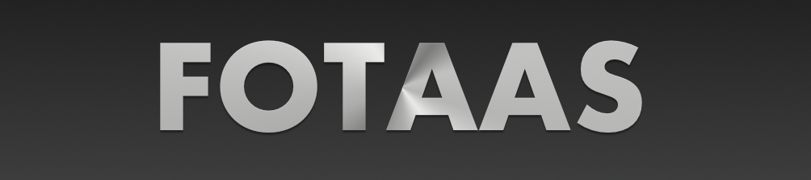
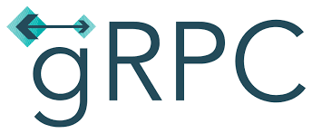
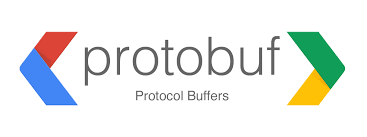

# Formula One Telemetry And Analysis System

### Powered By

    
    
        
    
    
    
    

## Table of Contents

- [Author](#author)
- [About](#about)
- [Installation](#installation)
- [Usage](#usage)

## Author
Barry T. Burch 

Barry is a digital native with over 20 years of experience in software/hardware design and engineering at:

    
    
    
    
    
    

barry@sbcglobal.net 
www.linkedin.com/in/barry-burch-digital-native 

## About

FOTAAS is a Golang portfolio project designed to demonstrate the following proficiencies:

* **Golang**
* **Golang Concurrency/Parallelism**
* **Golang Code Generation**
* **Micro-Service Architecure**
* **Protobuf & gRPC**
* **Cobra**
* **Golang Web Application Development**
* **Docker**
* **Kubernetes**
* **Cloud Deployment To GCP (Google Cloud Platform) GKE (Google Kubernetes Environment)**

The FOTAAS system consists of 4 micro-services (telemetry, simulation, analysis, status), a CLI (Command Line Interface)
application, and a Console Web application. The 4 micro-services are completely de-coupled from each other via gRPC APIs
and each service encapsulates a private datastore that can only be accessed via API calls to the service (i.e. this is a
true micro-services based architecture).

## Build & Deployment

The 4 FOTAAS services, console web application, and CLI application are built with docker compose. The resulting docker
images are pushed to GCR (Google Container Registry) and the system is deployed to a GKE (Google Kubernetes Environment)
cluster via kubectl and a non-trivial (i.e. production quality) orchestration yaml.

While you can easily enough clone the FOTASS repo for code review, deploying it to a GKE cluster will not be trivial
(e.g. the GCP Cloud SQL databases would need to created and migrated and this process is not currently documented).

## Usage

To see the FOTAAS system in action please contact me (barry@sbcglobal.net). We can schedule a Google Meet
(or Hangout) and I can demonstrate the FOTASS GCP deployment, CLI usage, and Console Web Application.
