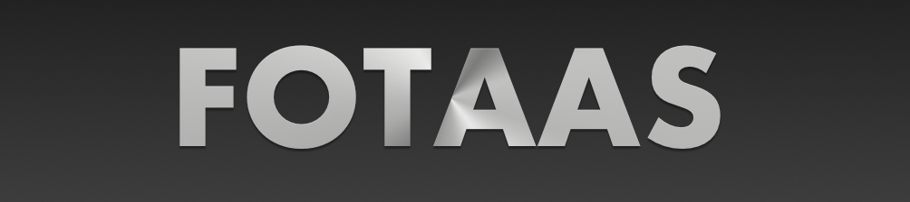
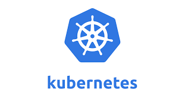
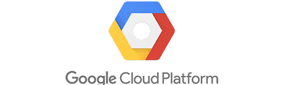
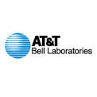
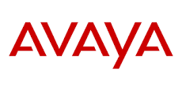
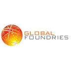

## Formula One Telemetry And Analysis System

## Powered By

    
    
    
    

    Font Size 24?

## Table of Contents

- [Author](#author)
- [About](#about)
- [Installation](#installation)
- [Usage](#usage)

## Author
Barry T. Burch 

Barry is a digital native with over 20 years of experience in software (and hardware) design and engineering at:

    
    
    
    
    
    

barry@sbcglobal.net 
www.linkedin.com/in/barry-burch-digital-native 

## About

FOTAAS is a Golang portfolio project designed to demonstrate the following proficiencies:

* **Golang**
* **Golang Concurrency/Parallelism**
* **Micro-Services Architecure**
* **Protobuf & gRPC**
* **Cobra**
* **Golang Web Application Development**
* **Docker**
* **Kubernetes**
* **Cloud Deployment To GCP (Google Cloud Platform) GKE (Google Kubernetes Environment)**
* **GIT**
* **mod**

The FOTAAS system consists of 4 micro-services: telemetry, simulation, analysis, and status. The 4 services
are completely de-coupled from each other via GRPC APIs and each service encapsulates a private datastore
that can only be accessed via API calls to the service (i.e. this is a true micro-services based architecture).

FOTASS includes both a Cobra based CLI (fotaasctl) and a console web application. Both can be used
to exercise the system.

## Installation

While you an easily enough clone the FOTASS repo for code review, deploying it with Kubernetes will not be
trival (e.g. the Cloud SQL databases would need to created and migrated and this process is not currently documented).

## Usage

If you want to see the FOTAAS Cloud depolyment in action, you will need to contact me (barry@sbcglobal.net). We
can schedule a Google Meet/Hangout and I can demonstrate the GCP GKE deployment, FOTAAS CLI, & FOTASS Web in action.
