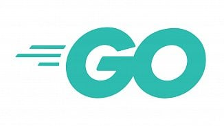
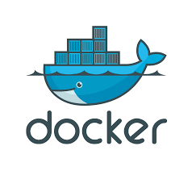
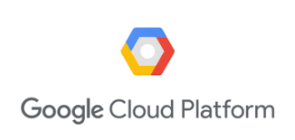
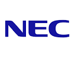

# Formula One Telemetry And Analysis System

### FOTAAS IS Powered By

    
    
        
    
    
    
    
    
    

## About The Author
Barry T. Burch 
barry@sbcglobal.net 

Barry is a digital native with over 30 years of experience in software/hardware design and engineering at:

    
    
    
    
    
    

barry@sbcglobal.net 
www.linkedin.com/in/barry-burch-digital-native 

## About The FOTAAS Project

FOTAAS is a Golang portfolio project designed to demonstrate technical proficiency with:

* **Golang**
* **Golang Concurrency/Parallelism**
* **Golang Code Generation**
* **Microservice Architecture**
* **Protobuf**
* **gRPC**
* **Cobra**
* **Golang Web Application Development**
* **Docker**
* **Kubernetes**
* **Cloud Deployment**

The FOTAAS deployment consists of 4 microservices (telemetry, simulation, analysis, status), a CLI (Command Line Interface)
application, a Console Web application, and a GCP Cloud SQL database. The 4 micro-services are completely de-coupled from
each other via gRPC APIs and each service encapsulates a private datastore that can only be accessed via API calls to the
that service (i.e. this is a true microservices based architecture).

## FOTAAS Build And Cloud Deployment

The 4 FOTAAS services, console web application, and CLI application are built with docker compose. The resulting docker
images are pushed to GCR (Google Container Registry) and the system is deployed to a GKE (Google Kubernetes Engine)
cluster via kubectl and a non-trivial (i.e. production quality) orchestration yaml.

While you can easily enough clone the FOTAAS repo for code review, deploying it to a GKE cluster will not be trivial
(e.g. the GCP Cloud SQL databases would need to created and migrated and this process is not currently documented).

## FOTAAS In Action

To see the FOTAAS system in action please contact me (barry@sbcglobal.net). We can schedule a Google Meet
(or Hangout) and I can demonstrate the FOTAAS GCP deployment, CLI usage, and Console Web Application.
